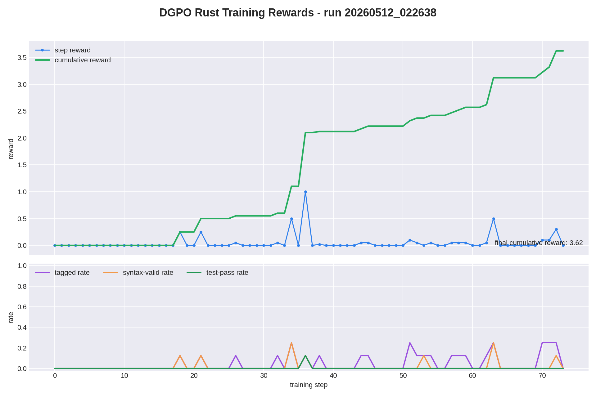

# Minimal GRPO / DGPO Implementation

Minimal implementations of:
- **GRPO** (Group Relative Policy Optimization) — DeepSeek's critic-free RL algorithm
- **DGPO** (Distribution-Guided Policy Optimization) — Token-level credit assignment via Hellinger distance + entropy gating

## Setup

```bash
uv sync
```

## Usage

### GRPO (baseline)

```bash
uv run python train.py
```

### DGPO (token-level reweighting)

```bash
uv run python train_dgpo.py
```

### Run tests

```bash
uv run python test_dgpo.py
```

## Configuration

Edit `train_dgpo.py` to change:

```python
model_name = "Qwen/Qwen3.5-4B"  # or "Qwen/Qwen3.5-2B" if OOM

# DGPO hyperparameters (from paper)
dgpo_tau = 0.5      # temperature for softmax reweighting
dgpo_kappa = 1.0    # entropy gating exponent

# Training
lr = 1e-6
weight_decay = 0.1
group_size = 8      # rollouts per prompt
train_batch_size = 4
max_length = 512
```

For real training, swap the toy dataset to DAPO-17K:
```python
from datasets import load_dataset
ds = load_dataset("OpenRLHF/dapo-math-17k", split="train")
```

## DGPO Algorithm

```
┌─────────────────────────────────────────────────────────────────────────────┐
│                          DGPO Pipeline                                      │
├─────────────────────────────────────────────────────────────────────────────┤
│                                                                             │
│  1. ROLLOUT                    2. SCORE TOKENS                              │
│  ┌─────────────┐               ┌──────────────────────────────────┐         │
│  │ Policy πθ   │──► Generate   │  For each token t:               │         │
│  │ Reference π │    G samples  │                                  │         │
│  └─────────────┘               │  d_t = 1 - Σ√(πθ · πref)        │         │
│        │                       │        (Hellinger distance)      │         │
│        ▼                       │                                  │         │
│  ┌─────────────┐               │  H_t = entropy(πθ) / log|V|     │         │
│  │ Reward r_i  │               │        (normalized uncertainty)  │         │
│  │ (verifier)  │               │                                  │         │
│  └─────────────┘               │  s_t = d_t · H_t^κ              │         │
│        │                       │        (gated deviation score)   │         │
│        ▼                       └──────────────────────────────────┘         │
│  ┌─────────────┐                              │                             │
│  │ A_i = norm  │                              ▼                             │
│  │ (r - μ) / σ │               3. REWEIGHT ADVANTAGES                       │
│  └─────────────┘               ┌──────────────────────────────────┐         │
│  (group advantage)             │  w_t = T · softmax(s_t / τ)     │         │
│                                │                                  │         │
│                                │  A_t = A_i · w_t                 │         │
│                                │  (token-level advantage)         │         │
│                                └──────────────────────────────────┘         │
│                                               │                             │
│                                               ▼                             │
│                                4. PPO-CLIP LOSS (no KL penalty)             │
│                                ┌──────────────────────────────────┐         │
│                                │  L = -min(ρ·A_t, clip(ρ)·A_t)   │         │
│                                └──────────────────────────────────┘         │
│                                                                             │
└─────────────────────────────────────────────────────────────────────────────┘
```

**Key insight:** GRPO broadcasts the same advantage A_i to every token. DGPO redistributes credit so pivotal reasoning steps get amplified gradients while routine syntax gets discounted.

## Hyperparameters

| Parameter | Value | Notes |
|-----------|-------|-------|
| τ (tau) | 0.5 | Softmax temperature (0.5-1.0 optimal) |
| κ (kappa) | 1.0 | Entropy gating exponent |
| lr | 1e-6 | Learning rate |
| weight_decay | 0.1 | AdamW weight decay |
| clip_eps | 0.2 | PPO clip epsilon |

## Files

| File | Description |
|------|-------------|
| `dgpo.py` | Core DGPO functions (Hellinger, entropy, reweighting) |
| `loss.py` | GRPOLoss and DGPOLoss classes |
| `train.py` | GRPO training loop |
| `train_dgpo.py` | DGPO training loop |
| `replay_buffer.py` | Experience storage and batching |
| `test_dgpo.py` | Unit tests for DGPO math |

## References

- [DGPO Paper (arXiv:2605.03327)](https://arxiv.org/abs/2605.03327) — Distribution-Guided Policy Optimization for Fine-Grained Credit Assignment
- [DeepSeek-R1](https://github.com/deepseek-ai/DeepSeek-R1) — GRPO origin
- [DeepSeekMath](https://arxiv.org/abs/2402.03300) — Mathematical reasoning with GRPO
- [tiny-grpo (upstream)](https://github.com/open-thought/tiny-grpo) — Original minimal GRPO implementation

## Latest Run Rewards


